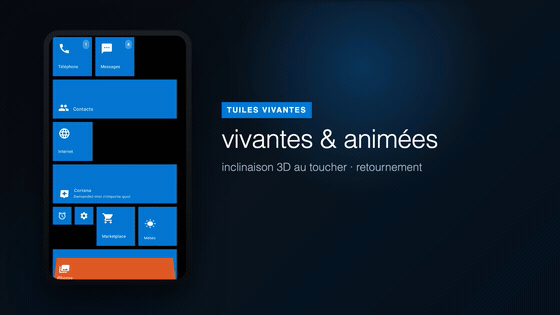

<div align="center">

# 📱 WP Launcher

### Bringing the Windows Phone "Live Tiles" Metro experience back to modern Android



[](https://www.android.com/)
[](https://kotlinlang.org/)
[](https://developer.android.com/jetpack/compose)
[](https://developer.android.com/tools/releases/platforms)
[](#-a-note-on-language)
[](LICENSE)
[](#-status)

</div>

---

## 💜 Why this exists

Windows Phone was discontinued years ago, but for many of us its Metro design language never stopped feeling like the future: bold typography, flat color, motion with purpose, and a home screen made of **Live Tiles** that breathed with your day.

**WP Launcher** is a love letter to that era. It is an Android home-screen launcher that faithfully recreates the **Windows Phone / Windows 10 Mobile** experience and **replaces your Android home screen entirely** — the tilting tiles, the flip animations, the jump-list app drawer, the Action Center, the Metro lock screen, even a "Cortana" you can chat with. It is **free and open source**, because that design deserves to live on.

If you ever missed your Lumia, this is for you.

---

## 🎬 Demo video

A full ~53-second narrated walkthrough is included in the repo, in both languages:

- 🇫🇷 [WP Launcher — Présentation (FR)](presentation/WP-Launcher-presentation-FR.mp4)


https://github.com/user-attachments/assets/d5e764ea-4bbc-4568-a97f-2e6a1af0832e


- 
- 🇬🇧 [WP Launcher — Presentation (EN)](presentation/WP-Launcher-presentation-EN.mp4)

The animated preview at the top of this page (`presentation/demo.gif`) gives you a quick taste.

---

## ✨ Features

### 🟦 Live Tiles home screen
- Dynamic tiles that **tilt in 3D** under your finger as you press them.
- Tiles **flip in 3D** to reveal back content — weather, calendar, photos, and more.
- Three tile sizes: **SMALL**, **MEDIUM**, and **WIDE**.
- An **edit mode** to pin, resize, reorder, and unpin tiles.

### 🔤 All Apps & search
- Alphabetical **A–Z** app list with a **jump-list index** for fast navigation.
- Built-in **search** to find any installed app instantly.

### ⚙️ Windows 10 Mobile-style Settings
- Categorized settings list with authentic **WP-style toggles**.
- About a dozen **accent colors** to personalize the whole system.
- **Wallpaper** and **parallax** options.

### 🗣️ "Cortana" assistant
- An in-app chat assistant backed by the **Google Gemini API** (in French).
- **Text-to-speech** voice replies.
- Works **offline too**: with no API key configured, Cortana falls back to canned local answers, so the app is fully usable without a key.

### 🔔 Action / Notification Center
- Pull it down for **quick toggles** — Wi-Fi, Bluetooth, Airplane mode, Location.
- Metro-style **notifications**.

### 🔒 Lock screen
- Metro lock screen with a **live clock** and your **next calendar event**.

### ⚡ Performance mode
- **Auto-detects** modest hardware and offers to simplify animations to stay fluid: the 3D tilt becomes a **zoom**, the 3D flip becomes a **fade**.
- Also available as a **manual toggle** in settings.

### 🎨 Windows Phone icon pack
- Renders app icons as flat **white Metro glyphs**.
- **Smart transparency detection** so full-bleed icons keep their original look.

### 🏠 True launcher integration
- Registers as the **default HOME launcher** via Android `RoleManager.ROLE_HOME`.
- **Hides the real Android status bar** to avoid duplication with its own WP-style status strip.

---

## 🧰 Tech stack

| Layer | Technology |
|-------|-----------|
| Language | **Kotlin** |
| UI | **Jetpack Compose** + **Material 3** |
| Architecture | Single-Activity **MVVM** |
| Persistence | **Room** (local database) |
| Async / state | **Kotlin Coroutines** + **StateFlow** |
| Networking | **Retrofit** + **Moshi** |
| Codegen | **KSP** |
| AI assistant | **Google Gemini API** (with offline local fallback) |

---

## 🔨 Build it yourself

### Requirements
- **Android Studio** (or a standalone **Android SDK** + an installed `gradle`).
- An Android device or emulator running **Android 6.0 (API 23)** or newer.

> ⚠️ **No Gradle wrapper is committed** to this repository. Use Android Studio's built-in Gradle integration, or an installed `gradle` from your command line (`./gradlew` will only work if a wrapper is added later).

### Build the debug APK

```bash
gradle :app:assembleDebug
```

Or simply open the project in **Android Studio** and run the `app` configuration.

| Property | Value |
|----------|-------|
| `minSdk` | 23 |
| `targetSdk` | 36 |
| `versionName` | 1.0 |

### 🔑 Gemini API key (optional)

The "Cortana" assistant can use the Google Gemini API, but it is **completely optional** — without a key, Cortana answers using local fallback responses, so the app builds and runs with no configuration.

To enable the online assistant:

1. Copy the example env file:
   ```bash
   cp .env.example .env
   ```
2. Set your key in `.env`:
   ```env
   GEMINI_API_KEY=your_key_here
   ```

The key is read from `.env` at build time and exposed to the app. When it is missing or left as the placeholder, the offline fallback is used automatically.

---

## 🗂️ Project structure

A single-module Android app:

```
wp-launcher/
├── app/                     # The launcher application module
│   └── src/main/java/com/example/
│       ├── MainActivity            # Single Activity, hosts the whole UI
│       ├── viewmodel/              # LauncherViewModel — owns all UI state
│       ├── repository/             # LauncherRepository — tiles, settings & installed apps
│       ├── data/                   # Room database, entities, DAO, Gemini service
│       └── ui/
│           ├── screens/            # Start, All Apps, Settings, Cortana + overlays
│           └── theme/              # Metro colors & typography
├── presentation/            # demo.gif and narrated promo videos (FR / EN)
├── gradle/                  # Version catalog (libs.versions.toml)
└── LICENSE                  # MIT
```

The app is built around a **single Activity** and a **single `LauncherViewModel`** that owns all UI state as `StateFlow`s; screen switching is done in-app (no Navigation library). **Room** persists home tiles and settings, while the repository also queries `PackageManager` for the installed-app list.

---

## 🌍 A note on language

The product is **French**, so the **entire UI is in French**. If you are an English speaker, the design and interactions will still feel familiar — Windows Phone is Windows Phone in any language — but the on-screen text is French. The codebase and this README are in English.

---

## 🗺️ Roadmap

- More Live Tile back-content types and richer dynamic updates.
- Additional accent colors and theming options.
- Expanded Cortana capabilities.
- Broader device compatibility and performance tuning.

> Suggestions and feature requests are welcome — open an issue!

---

## 🤝 Contributing

Contributions are warmly welcomed — whether it is a bug fix, a new tile type, an extra accent color, or just polishing the Metro feel.

- Open an **issue** to report a bug or suggest a feature.
- Send a **pull request** with your improvements on [GitHub](https://github.com/UnixSafe/wp-launcher).
- Keep new **UI text in French** to match the rest of the product.
- Follow the existing code conventions (4-space Kotlin indentation, PascalCase composables/classes).

If you loved Windows Phone, help us keep it alive. 💜

---

## 📊 Status

**v1.0-beta** — free and open source. No paid services are required (Gemini is optional). Feedback, issues, and pull requests are very welcome.

---

## 📄 License

This project is licensed under the **MIT License** — see the [LICENSE](LICENSE) file for details.

---

<div align="center">

Built by **Jeremy Fievet** ([@UnixSafe](https://github.com/UnixSafe))

Repository: [github.com/UnixSafe/wp-launcher](https://github.com/UnixSafe/wp-launcher)

⭐ If you miss Windows Phone, give this a star!

</div>
